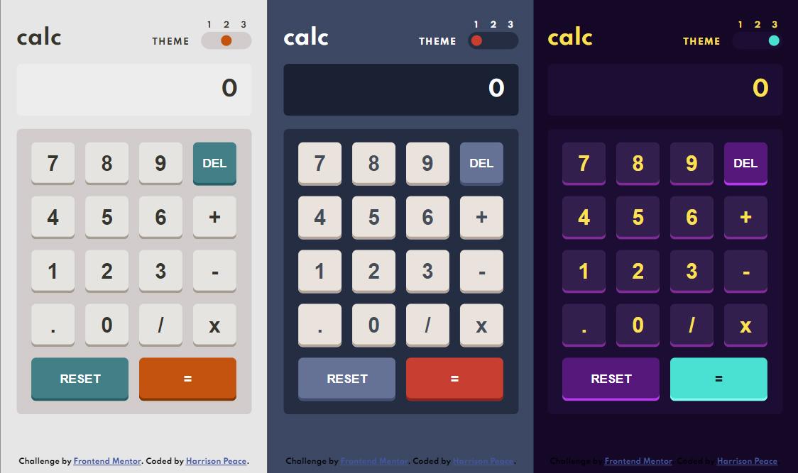

# Frontend Mentor - Calculator app solution

This is a solution to the [Calculator app challenge on Frontend Mentor](https://www.frontendmentor.io/challenges/calculator-app-9lteq5N29). Frontend Mentor challenges help you improve your coding skills by building realistic projects. 

## Table of contents

- [Overview](#overview)
  - [The challenge](#the-challenge)
  - [Screenshot](#screenshot)
  - [Links](#links)
- [My process](#my-process)
  - [Built with](#built-with)
  - [What I learned](#what-i-learned)
  - [Useful resources](#useful-resources)
- [Author](#author)

## Overview

### The challenge

Users should be able to:

- See the size of the elements adjust based on their device's screen size
- Perform mathmatical operations like addition, subtraction, multiplication, and division
- Adjust the color theme based on their preference
- **Bonus**: Have their initial theme preference checked using `prefers-color-scheme` and have any additional changes saved in the browser

### Screenshot



### Links

- Solution URL: [https://github.com/HarrisonPeace/Calculator-App](https://github.com/HarrisonPeace/Calculator-App)
- Live Site URL: [https://harrisonpeace.com/Calculator-App/](https://harrisonpeace.com/Calculator-App/)

## My process

### Built with

- Semantic HTML5 markup
- CSS custom properties
- Flexbox
- CSS Grid
- Mobile-first workflow

### What I learned

This project was a great refresher on using CSS selectors and variables as well as flexbox and CSS grid.

Using the same name for color themes in both the JavaScript and HTML I was able to make the event listener very compact and without any if statements.

```js
themeControlsContainer.addEventListener('click', (e) => {
  root.style.cssText = colorSchemes[e.target.id]; 
  localStorage.setItem('theme', `${e.target.id}`);
}
```

Using ```document.documentElement.style.cssText = "INSERT CSS STYLES"``` to select the root element and update its CSS made updating the color scheme intuitive and easy to execute.

### Useful resources

- [Box Shadow Generator](https://html-css-js.com/css/generator/box-shadow/) - Made it alto easier to get the box shadow looking close to the design

## Author

- Website - [Harrison Peace](https://harrisonpeace.com)
- Frontend Mentor - [@HarrisonPeace](https://www.frontendmentor.io/profile/HarrisonPeace)
